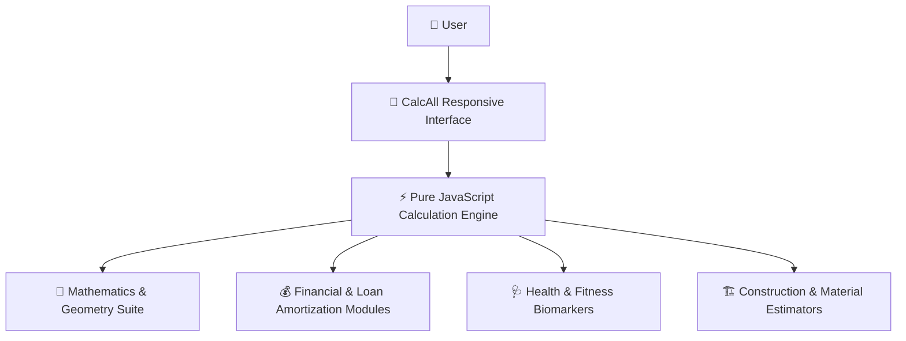

# CalcAll – Next-Generation Universal Calculator Ecosystem

CalcAll is a premium, zero-dependency utility portal hosting a vast suite of over 190+ calculators across Math, Finance, Health, and Construction/Everyday tools. Designed to load instantly and operate entirely in the browser, the site provides real-time, interactive tools to help individuals make informed decisions, solve complex equations, and streamline daily planning.

---

## 🖼️ Visual Tour & Screenshots

Explore the CalcAll user interface across category hubs and interactive tool pages:

### 🏠 Homepage & Ecosystem Overview

| View | Screenshot | Description |
| :--- | :--- | :--- |
| **Homepage Hero** |  | Instant universal search across 190+ calculators, dynamic font selector, dark/light theme toggle, and quick category shortcuts. |
| **Full Dashboard** |  | Complete homepage with featured categories, popular tools, personalized **Favorites**, and **Recently Used** calculator history. |

---

### 📂 Category Hubs

| Category Hub | Screenshot | Description |
| :--- | :--- | :--- |
| **Financial Calculators** |  | **71 Financial Tools**: Comprehensive suite for mortgages, loan amortization, house affordability, debt-to-income, and rent vs. buy analysis. |
| **Fitness & Health** |  | **29 Health Tools**: Body Mass Index (BMI), daily calorie & BMR requirements, body fat, ideal weight, and running pace calculators. |
| **Math Calculators** |  | **38 Mathematical Tools**: Scientific algebra, percentage change, fraction operations, exponents, and percent error calculators. |
| **Other Tools** |  | **53 Everyday Utilities**: Age calculation, date math, time card tracking, timesheet auditing, and timezone conversion tools. |

---

### 🔍 Interactive Calculators & Tools

| Calculator | Interface Screenshot | Features & Capabilities |
| :--- | :--- | :--- |
| **Scientific Calculator** |  | Interactive scientific keypad with degree/radian toggles, trig functions, logs, powers, and full formula evaluation. |
| **Mortgage Calculator** |  | Real-time mortgage payment estimation breakdown into principal, interest, HOA fees, and property taxes. |
| **Compound Interest** |  | Long-term growth projection calculating future balance from initial capital, annual interest rate, and monthly deposits. |
| **BMI Calculator** |  | Dynamic Body Mass Index evaluator supporting metric/imperial units with instant CDC weight category classification. |
| **All Tools Directory** |  | Filterable A-Z master directory listing all 190+ tools with live search and category sorting. |

---

## 💡 Why and How This Site is Useful (User Benefits)

CalcAll is designed to be a highly practical assistant for various life scenarios. Since all calculations are done directly on your device with no remote database queries, your data remains completely private. 

Here is how CalcAll directly benefits different users:

### 🏠 For Homebuyers, Renters, and Investors (Finance)
*   **Budgeting & Affordability:** The **House Affordability Calculator** uses standard Debt-to-Income (DTI) ratios to determine how much home you can afford, preventing over-borrowing.
*   **Buying vs. Renting:** The **Rent vs. Buy Calculator** runs long-term financial projections comparing equity gains against renting to help you choose the best housing path.
*   **Loan Optimizations:** The **Mortgage Payoff Calculator** shows how much time and interest you save by making extra payments, helping you pay off debt years ahead of schedule.

### 🎓 For Students, Educators, and Developers (Math)
*   **Scientific Problem Solving:** The **Scientific Calculator** parses complex algebraic, trigonometric, and logarithmic expressions with standard mathematical hierarchy.
*   **Number Conversions:** The **Binary & Hex Calculators** allow computer science students and developers to convert and perform operations between Base-2, Base-10, and Base-16 values with step-by-step explanations.
*   **Clear Explanations:** Many calculators (like the **Percentage** and **Fraction** calculators) provide written mathematical breakdowns showing you exactly *how* the result was calculated, serving as an educational resource.

### 🏃 For Fitness Enthusiasts and Health Tracking (Health & Wellness)
*   **Body Metrics:** The **BMI Calculator** uses metric or imperial units to visually map your body mass classification against healthy CDC ranges on a dynamic color-coded gauge.
*   **Dietary Planning:** The **Calorie & BMR Calculators** estimate daily energy requirements for maintenance, weight loss, or weight gain based on individual activity levels and the Mifflin-St Jeor equation.
*   **Family Milestones:** The **Pregnancy Due Date & Ovulation Calculators** forecast fertile windows and estimate gestational dates based on Naegele's rule.

### 🔨 For Contractors and DIY Builders (Construction)
*   **Material Estimating:** The **Concrete, Gravel, and Mulch Calculators** determine the exact volume or weight in cubic yards/tons needed for slabs, driveways, or landscaping.
*   **Building Code Layouts:** The **Stair Calculator** computes vertical riser heights and tread runs from standard code restrictions, preventing design errors before purchasing materials.
*   **Roof Planning:** The **Roofing Calculator** translates footprint dimensions and pitch selections into the exact number of shingles bundles required.

---

## ⚙️ How the Website Works (The Mechanics)

CalcAll operates using a hybrid **static-site generation (SSG)** and **client-side hydration** paradigm:

1.  **Static Page Generation (`build.js`):**
    *   During the build process, `build.js` reads templates (like `base.html` and `detail.html`) and lists of calculators from the `src/data/` modules.
    *   It merges these components into flat, clean-routed directories inside `dist/` (e.g., `dist/financial/mortgage-calculator/index.html`).
    *   It also compiles XML and HTML sitemaps to optimize search engine accessibility.
2.  **Zero-Dependency Client-Side Runtime:**
    *   Once a user visits a calculator, `calculator-runtime.js` binds event listeners to all input elements. 
    *   As you change numbers, sliders, or drop-downs, the runtime immediately executes the specific math logic defined in the dataset (e.g., `math.js`) and updates the results on screen instantly with no page reload.
3.  **Collaborative State Sharing:**
    *   Every input modification is synced directly into the browser's URL query parameters in real time.
    *   You can click **"Copy Link"** to copy the exact URL. When shared with others, the page recovers these values, auto-populates the forms, and runs the calculations immediately.
4.  **LocalStorage Integration:**
    *   **Favorites:** Users can toggle the heart icon on any calculator. The tool's ID is stored in the browser's `localStorage`, allowing the homepage to dynamically display a personalized list of favorite tools.
    *   **Recents:** The site tracks recently opened calculators and lists them on the homepage.
5.  **Dynamic Rendering:**
    *   High-performance SVG path strings are generated in the browser to draw vector charts for loan schedules or compound growth charts on-the-fly.

---

## 📦 What is Present in the Website

*   **190+ Calculators:** Across four major categories (Math, Financial, Health, and Other Utility/Construction).
*   **Interactive Keypad:** Fully interactive scientific calculator layout.
*   **Dynamic Theme Toggle:** Fluid transitioning between dark mode and light mode, with automatic system preference detection.
*   **Custom Font Selector:** Dropdown selector to change display fonts (Outfit, Comic Sans, Century Gothic, Bell MT, Times New Roman) dynamically.
*   **Universal Search Bar:** Autocomplete search input that finds calculators by name, description, or category tags.
*   **A-Z Directory:** A dedicated folder structure page (`/all/`) allowing users to filter, sort, and browse all calculators alphabetically.

---

## 🚀 How the Website Runs

This ecosystem requires **no external packages or dependencies** to run locally.

### Using Node.js (Recommended for Developers)
If you have Node.js installed, you can build and run the development server with automatic file-watching:
1.  **Build the static site:**
    ```bash
    node build.js
    ```
2.  **Start the server:**
    ```bash
    npm run dev
    # or
    node dev.js
    ```
3.  Open the local server URL in your browser. Any edits in the `src/` directory will trigger the watcher to auto-rebuild the pages.

### Using Python (Fallback Server)
If Node.js is not installed on your system, you can run the pre-built site using Python's built-in HTTP server:
1.  **Serve the directory:**
    ```bash
    python -m http.server 3000 --directory dist
    ```
2.  Open the local server URL in your web browser.

---

## 💝 Gratitude & Thanks

Thank you so much for visiting this repository and taking the time to explore CalcAll! Your presence and interest in this project are sincerely appreciated. 

Building this ecosystem has been a journey of precision, user-focused design, and performance optimizations. I hope exploring it brings you inspiration or value. If you have any feedback, suggestions, or just want to connect, please feel free to reach out. 

Wishing you the absolute best in all your endeavors, and thank you once again for stopping by! ✨

---

---

## 🏛️ System Architecture



---

## 💖 Thank You for Visiting & Exploring CalcAll – Next-Generation Universal Calculator Ecosystem!

> *"Thank you for taking the time to explore this project! Continuous learning, clean craftsmanship, and solving real-world challenges through elegant software are at the core of my developer journey."* 🚀

* 🌟 **Enjoyed this project?** If you found this repository interesting or helpful, please consider giving it a **Star**!
* 📬 **Let's Connect & Collaborate:** I am actively seeking engineering opportunities, impactful internships, and open-source collaborations. Feel free to connect via [GitHub](https://github.com/SriniwasAwasthi) or [Email](mailto:sriawasthi164@gmail.com)
  * 🌐 **LinkedIn:** [https://www.linkedin.com/in/sriniwas-awasthi/](https://www.linkedin.com/in/sriniwas-awasthi/).

---
<div align="center">
  <sub>Designed & Crafted with Passion by <a href="https://github.com/SriniwasAwasthi"><strong>Sriniwas Awasthi</strong></a> • Continuous Learner & Software Engineer</sub>
</div>
