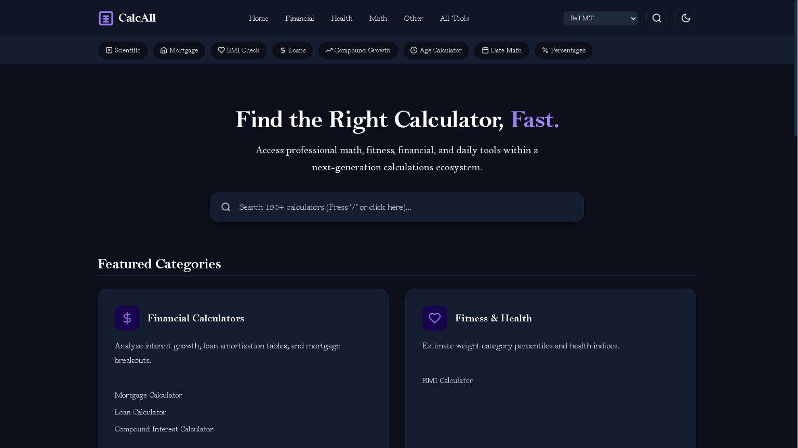
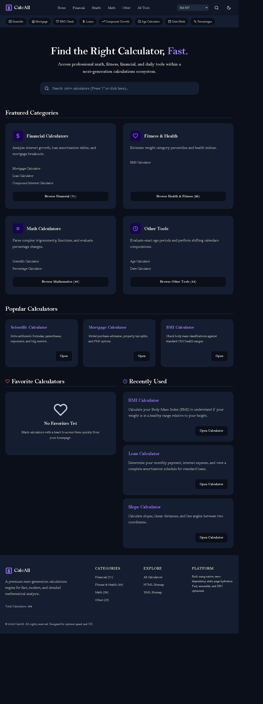
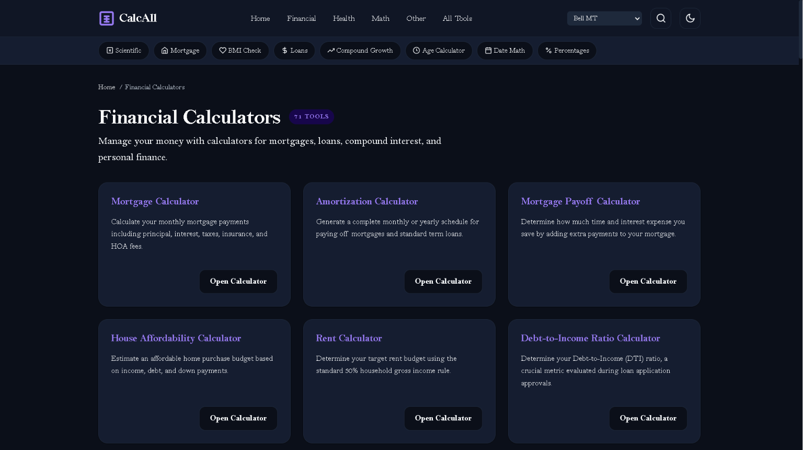
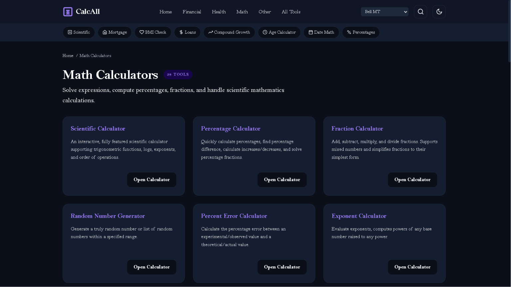
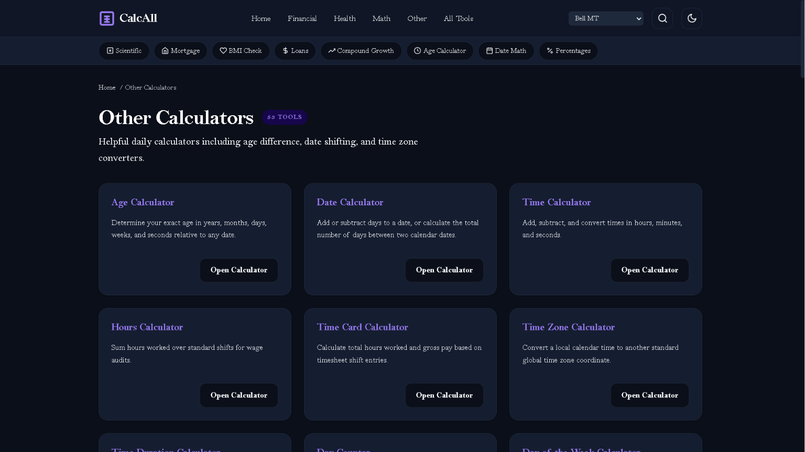
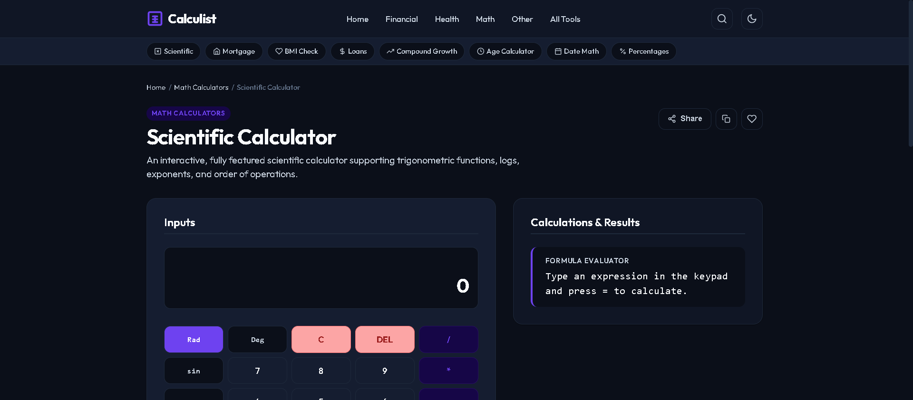
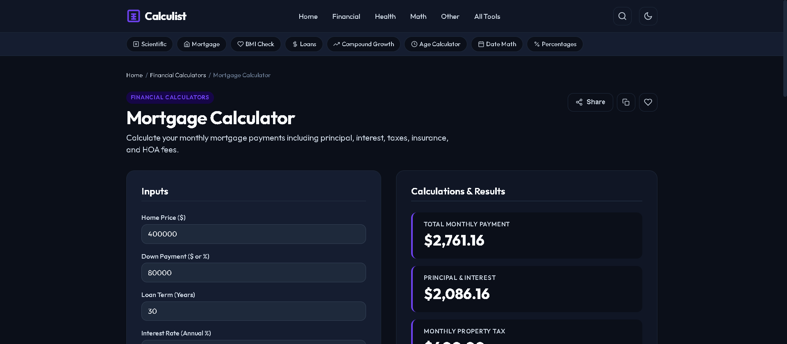
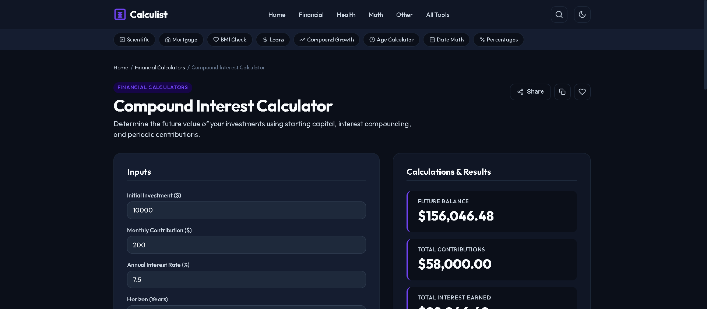
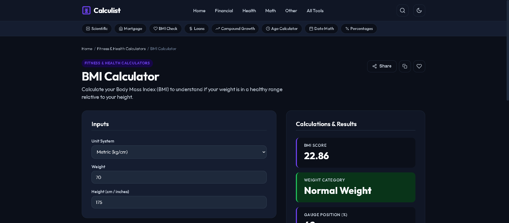
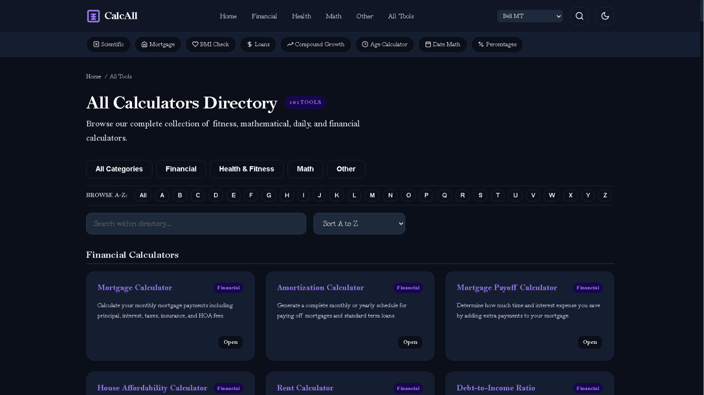

#+TITLE: CalcAll – Next-Generation Universal Calculator Ecosystem
#+AUTHOR: CalcAll Team

* CalcAll – Next-Generation Universal Calculator Ecosystem

CalcAll is a premium, zero-dependency utility portal hosting a vast suite of over 190+ calculators across Math, Finance, Health, and Construction/Everyday tools. Designed to load instantly and operate entirely in the browser, the site provides real-time, interactive tools to help individuals make informed decisions, solve complex equations, and streamline daily planning.

* 🖼️ Visual Tour & Screenshots

Explore the CalcAll user interface across category hubs and interactive tool pages:

** 🏠 Homepage & Ecosystem Overview

- *Homepage Hero Section*: 
  Instant universal search across 190+ calculators, dynamic font selector, dark/light theme toggle, and quick category shortcuts.

- *Full Dashboard View*: 
  Complete homepage with featured categories, popular tools, personalized Favorites, and Recently Used calculator history.

** 📂 Category Hubs

- *Financial Calculators*: 
  71 Financial Tools for mortgages, loan amortization, house affordability, debt-to-income, and rent vs. buy analysis.

- *Fitness & Health*: 
  29 Health Tools for Body Mass Index (BMI), daily calorie & BMR requirements, body fat, ideal weight, and running pace calculators.

- *Math Calculators*: 
  38 Mathematical Tools for scientific algebra, percentage change, fraction operations, exponents, and percent error calculators.

- *Other Tools*: 
  53 Everyday Utilities for age calculation, date math, time card tracking, timesheet auditing, and timezone conversion tools.

** 🔍 Interactive Calculators & Tools

- *Scientific Calculator*: 
  Interactive scientific keypad with degree/radian toggles, trig functions, logs, powers, and full formula evaluation.

- *Mortgage Calculator*: 
  Real-time mortgage payment estimation breakdown into principal, interest, HOA fees, and property taxes.

- *Compound Interest Calculator*: 
  Long-term growth projection calculating future balance from initial capital, annual interest rate, and monthly deposits.

- *BMI Calculator*: 
  Dynamic Body Mass Index evaluator supporting metric/imperial units with instant CDC weight category classification.

- *All Tools Directory*: 
  Filterable A-Z master directory listing all 190+ tools with live search and category sorting.

* 💡 Why and How This Site is Useful (User Benefits)

CalcAll is designed to be a highly practical assistant for various life scenarios. Since all calculations are done directly on your device with no remote database queries, your data remains completely private.

** 🏠 For Homebuyers, Renters, and Investors (Finance)
- *Budgeting & Affordability*: The House Affordability Calculator uses standard Debt-to-Income (DTI) ratios to determine how much home you can afford.
- *Buying vs. Renting*: The Rent vs. Buy Calculator runs long-term financial projections.
- *Loan Optimizations*: The Mortgage Payoff Calculator shows interest savings from extra payments.

** 🎓 For Students, Educators, and Developers (Math)
- *Scientific Problem Solving*: The Scientific Calculator parses complex expressions.
- *Number Conversions*: Binary & Hex Calculators support Base-2, Base-10, and Base-16 conversions.

* ⚙️ How the Website Works (The Mechanics)

1. Static Page Generation (build.js)
2. Zero-Dependency Client-Side Runtime
3. Collaborative State Sharing
4. LocalStorage Integration
5. Dynamic Rendering

* 🚀 How the Website Runs

** Using Node.js
#+BEGIN_SRC bash
node dev.js
#+END_SRC

** Using Python
#+BEGIN_SRC bash
python -m http.server 3000 --directory dist
#+END_SRC
